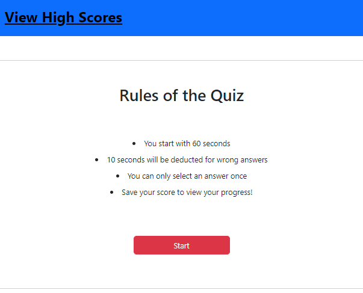

# timed-javascript-quiz-wk

## Description

This is a short timed quiz about Javascript. I created this project to showcase my Javascript skils. I wrote the code in a couple languages but tried my hardest to keep my markup language code to a minimum and use JS for a majority of the page.

I spent the most time figuring out how to render an array of objects from local storage. Being my first time writing addEventListers, I had a difficult time keeping track of whether I should be editing the function or the addEventListener. Keeping track of the large number of variables was also tricky.

It took a lot of testing, editing and I even restarted the project twice. After finishing this project, I've learned that organization and planning early before trying to execute is important. It gives me a baseline to work with, saves a ton of time and helps me keep my code straight to the point.

Enjoy!

## Installation

 * To deploy application, go to [My Github Project](https://wiilki.github.io/timed-javascript-quiz-wk/)

## Usage

 * Click red "Start" button to begin.
 * Answer questions to quiz
 * Complete form to save your score
 * Click "View High Scores" to view previous scores
 * Play again or clear past scores

## Credits

* [Bootstrap](https://cdn.jsdelivr.net/npm/bootstrap@5.2.2/dist/css/bootstrap.min.css)
* [Jquery](https://code.jquery.com/jquery-3.5.1.min.js)
